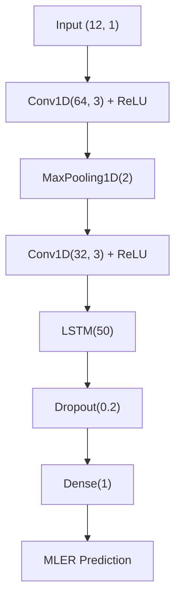

# 📊 Charting by Machines — A-Share Market Replication

> Replication of Murray, Xia, Xiao (2024, JFE) in China's A-share market using CSMAR data (1997–2024)

---

## 🎯 Executive Summary

**Charting by Machines** (Murray, Xia, Xiao, 2024, *Journal of Financial Economics*) demonstrates that machine learning models can forecast stock returns from historical price patterns, challenging the Efficient Market Hypothesis. This project rigorously replicates their methodology in China's A-share market using CSMAR monthly data (1997–2024).

《Charting by Machines》 (Murray, Xia, Xiao, 2024, 《Journal of Financial Economics》) 证明机器学习模型能够从历史价格形态中预测股票收益，挑战了有效市场假说。本项目使用 CSMAR 月度数据（1997–2024），在中国A股市场严格复现了该方法。

---

## 🧠 Methodology

| Component | Specification |
| :--- | :--- |
| **Data Source** | CSMAR TRD_Mnth (monthly stock returns) |
| **Sample Period** | 1997–2024 (720,607 observations after cleaning) |
| **Input Features** | CR₁–CR₁₂ (12 monthly cumulative returns) |
| **Target Variable** | rNorm (cross-sectional normal score) |
| **Model Architecture** | CNN-LSTM: Conv1D(64) → MaxPooling → Conv1D(32) → LSTM(50) → Dropout(0.2) → Dense(1) |
| **Training Strategy** | Expanding window + 20× ensemble average |
| **Test Period** | 2015–2024 (10 years, 120 months) |

### Model Architecture Diagram

---

## 📚 Citation

Murray, S., Xia, Y., & Xiao, H. (2024). Charting by machines. Journal of Financial Economics, 153, 103791.

---

## ⚠️ Disclaimer

This project is for academic research purposes only. All results are based on historical data and do not constitute investment advice. Past performance does not guarantee future results. 

---

## ⭐ Star This Project

If you find this replication useful, please give it a Star ⭐ on GitHub!
